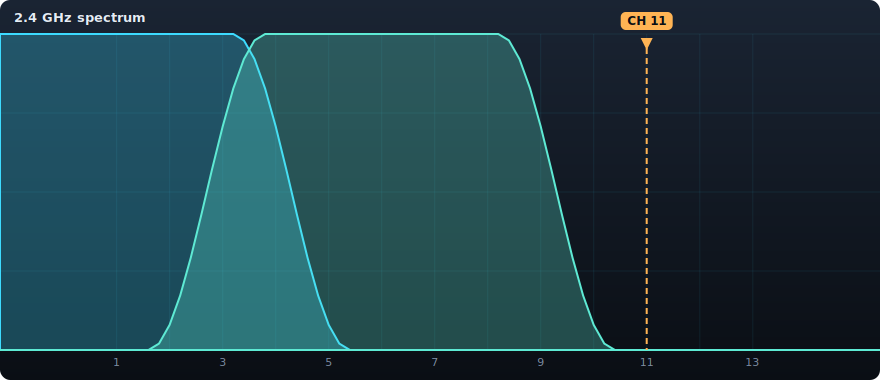

# Channel Clear

**▶ Live demo: [apps.charliekrug.com/channel-clear](https://apps.charliekrug.com/channel-clear/)**

[](https://github.com/ctkrug/channel-clear/actions/workflows/ci.yml)
[](LICENSE)

Find the clear channel for your router. Type in the Wi-Fi your phone already sees and get the
least-congested 2.4GHz or 5GHz channel in one click, with the overlap drawn live.



## Who it's for

Anyone in an apartment or a crowded block whose Wi-Fi keeps stalling because a dozen neighbors'
routers are piled onto the same channels. No networking background needed: if you can open your
phone's Wi-Fi settings, you have everything Channel Clear asks for.

## Why it exists

Every "Wi-Fi analyzer" wants a native install with location permission, or a login, just to tell
you "channel 6 is busy" with no reasoning behind it. But your phone already shows the raw
ingredients: the names and channels of the networks around you. Channel Clear takes that list and
does the part that actually takes knowledge, the channel-width and adjacent-channel overlap math,
then shows its work on a live chart instead of hiding it behind a score.

## What it does

- Add each neighboring network you can see (name, band, channel).
- Watch a live 2.4GHz/5GHz spectrum chart redraw with every network's real overlap curve, not just
  a list of channels in use.
- Get the single least-congested channel for your own router, marked on the chart.
- Copy a link that reproduces your exact spectrum, or reload and pick up where you left off.
- Everything runs in the browser. No accounts, no network calls, nothing you type ever leaves your
  device.

## How to use it

1. Open your phone's Wi-Fi settings (or any Wi-Fi list) and note the networks around you, each with
   its name and channel.
2. Pick the band (**2.4 GHz** or **5 GHz**) and add each network. The chart redraws live with every
   network's overlap curve.
3. Read the **Recommended** channel above the chart. The amber marker points at the least-congested
   channel for the selected band. Set your router there.

The 2.4 GHz and 5 GHz bands are tracked independently, so switching the toggle re-scopes the chart
and recommendation without losing what you entered on the other band.

## How the math works

Each network is modeled as a raised-cosine energy curve centered on its channel and about as wide
as a real Wi-Fi channel (22 MHz on 2.4GHz, 20 MHz on 5GHz), tapering toward zero at roughly twice
its half-width. Two routers three channels apart therefore register as partial interference rather
than "unrelated," which is why 1, 6, and 11 come out clean on 2.4GHz. The recommendation is the
channel whose summed overlap against every network you entered is lowest, with ties broken toward
the lower channel number for a stable, explainable answer. The model lives in
[`src/wifi/overlap.js`](src/wifi/overlap.js) and is covered by unit and property-based tests.

## Stack

- Vanilla JavaScript and HTML5 Canvas (no UI framework, because the chart is the product)
- [Vite](https://vitejs.dev/) for the dev server and static build
- [Vitest](https://vitest.dev/) with [fast-check](https://fast-check.dev/) for unit and
  property-based tests on the overlap math
- Zero backend: ships as a static site, deployable to any static host or subpath

## Local development

```bash
npm install
npm run dev      # local dev server
npm test         # run the full test suite (domain math, state, chart, UI)
npm run coverage # test suite with v8 coverage report
npm run lint     # ESLint
npm run build    # static build to site/ (base-path relative, subpath-safe)
```

## Project docs

- [`docs/VISION.md`](docs/VISION.md): the problem and the design decisions
- [`docs/ARCHITECTURE.md`](docs/ARCHITECTURE.md): the code map and data flow
- [`docs/DESIGN.md`](docs/DESIGN.md): the visual direction and tokens
- [`docs/BACKLOG.md`](docs/BACKLOG.md): the story breakdown

## License

MIT, see [LICENSE](LICENSE).

---

More of Charlie's projects → [apps.charliekrug.com](https://apps.charliekrug.com)
